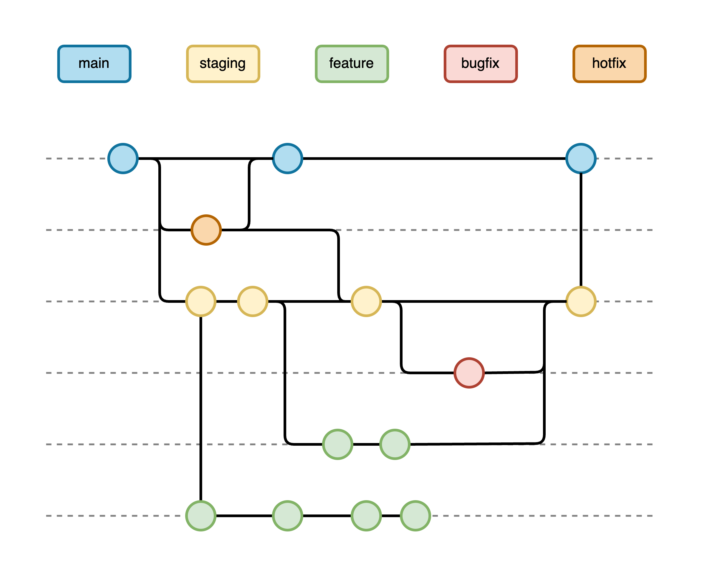
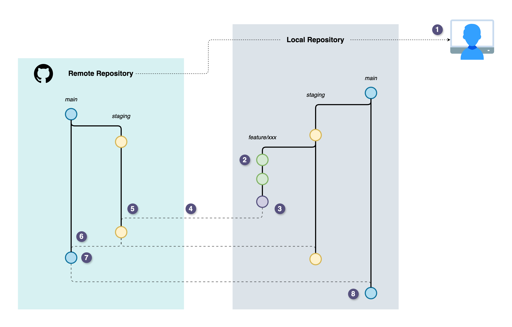

# Contributing

Thank you for contributing to our project! This guide outlines our team's standards and practices to ensure a smooth workflow and high-quality code. It covers our Git branching strategy, release process, workflow, code review guidelines, issue tracking, commit conventions, and general best practices. Please read through and follow these guidelines when making contributions.

## Table of Contents

- [Contribution Guidelines](#contribution-guidelines)
  - [Git Branching Strategy](#git-branching-strategy)
  - [Release Strategy](#release-strategy)
- [Code Update Workflow](#code-update-workflow)
  - [Step-by-Step Process Overview](#step-by-step-process-overview)
  - [Contributor's Step-by-Step Guide](#contributors-step-by-step-guide)
  - [Reviewer's Step-by-Step Guide](#reviewers-step-by-step-guide)
- [Pull Request & Code Review Practices](#pull-request--code-review-practices)
- [Issue Tracking & Commit Message Conventions](#issue-tracking--commit-message-conventions)
- [General Best Practices](#general-best-practices)

## Contribution Guidelines <a id="contribution-guidelines"></a>

### Git Branching Strategy <a id="git-branching-strategy"></a>

Our team follows a clear branching strategy (inspired by [GitFlow](https://www.atlassian.com/git/tutorials/comparing-workflows/gitflow-workflow)) to organize development work. We use a set of permanent branches for different stages of code readiness, and short-lived branches for individual tasks. Follow these guidelines to ensure smooth integration and maintain the quality of the project. Adhering to these best practices will streamline the review process and keep the codebase clean. The diagram below illustrates the relationship between branches in our workflow:



_Example Git branching workflow with feature, staging, and main branches. New features and bug fixes are developed on separate branches, merged into the `staging` branch for testing, and finally merged into `main` for release. Hotfixes for production are branched from `main` and then applied to both `main` and `staging`._

- `main` — **Production Branch**: The `main` branch contains stable, production-ready code. Deployments to the live site come from `main`. Only thoroughly tested changes should reach this branch. We protect `main` to prevent direct commits – all changes must be merged via pull requests (usually from `staging` or a `hotfix` branch). Think of `main` as the source of truth for what is running in production.

- `staging` — **Pre-Production/Test Branch**: The `staging` branch is our integration branch used for pre-production testing. New features and bug fixes are first merged here and deployed to a `staging` environment (if available) for QA and verification. This branch should always have the next intended release. Once code on `staging` is confirmed stable, it will be merged into `main`. Like `main`, we typically protect `staging` (changes come in via pull requests from `feature`/`bugfix` branches). This ensures everything in `staging` has been reviewed and tested.

- `release/yyyy-mm-dd` — **Release Branches**: Release branches follow the naming convention `release/yyyy-mm-dd`, indicating the scheduled release date. These branches are created from `main` when preparing a stable set of changes for a planned release. Features and bug fixes intended for the current release are selectively cherry-picked from `staging` onto the release branch. Once a release branch is created, it is used to finalize testing, documentation, and minor fixes specific to that release. No major features or significant new developments should be introduced at this stage. After successful testing and approval, the release branch is merged back into `main`, tagged with a version number, and deployed to production. This approach clearly tracks releases, simplifies deployment processes, and allows parallel stabilization activities separate from ongoing development on `staging`.

- `feature/xxx` — **Feature Branches**: Each new feature or enhancement should be developed in its own branch off of `staging` (or off a `dev` branch, if we use one; see below). Name the branch descriptively, e.g., `feature/login-page` or `feature/ai-scheduling-agent`. These branches are short-lived; once the feature is complete and tested locally, you will merge it into `staging` through a pull request. Feature branches help isolate development work until it's ready to be integrated.

- `bugfix/xxx` — **Bug Fix Branches**: Non-critical bug fixes (issues found in the `staging` environment or during development) are addressed in `bugfix` branches. Branch off from `staging` for a bug that exists in the `staging` code (or `dev` if applicable). For example, `bugfix/appointment-date-validation`. After fixing the bug and testing, merge the `bugfix` branch back into `staging` via a pull request. This ensures the fix is included in the next release. (For critical bugs in production, see hotfix below.)

- `hotfix/xxx` — **Hotfix Branches**: Hotfix branches are for urgent fixes to production issues. If a critical bug is discovered in `main` (production), create a branch off `main` (e.g., `hotfix/payment-crash`) to fix the issue. After testing the fix, open a pull request to merge the hotfix branch into `main` and also into `staging`. Merging into `main` allows us to deploy the fix immediately to production, and merging into `staging` ensures the fix is not lost and will be part of the next release as well. Hotfix branches should be used only for high-priority emergencies.

- `dev` **(Optional)** — **Development Integration Branch**: Our team may choose to include a `dev` (or `develop`) branch as an additional integration branch. This branch would be where all `feature` and `bugfix` branches merge first, acting as the bleeding-edge of development. The `dev` branch, if used, always contains the latest combined work from all developers. We would periodically merge `dev` into `staging` for testing (and then to `main` for release). Having a `dev` branch can be useful for larger teams to separate untested code from the more stable `staging` branch. However, for a simpler workflow, we often skip the `dev` branch and use `staging` as the primary integration branch. If your team decides to use `dev`, treat it similarly to `staging` (protected and updated via PRs), and branch features off `dev` instead of `staging`. In summary, including a `dev` branch is optional — it adds an extra layer of integration, which can be helpful as the team grows, but it’s not required if the `staging` branch already fulfills the role of integrating and testing new code.

**Summary of branch purposes**:

| **Branch**           | **Purpose**                                                           |
| -------------------- | --------------------------------------------------------------------- |
| `main`               | Stable production code; release-ready.                                |
| `staging`            | Aggregate of completed features for the next release; testing ground. |
| `dev`                | (If used) Active development integration; latest untested code.       |
| `release/yyyy-mm-dd` | Cherry-picked features for the next release (pre-release).            |
| `feature/xxx`        | Individual new feature development.                                   |
| `bugfix/xxx`         | Fixes for issues on staging (pre-release).                            |
| `hotfix/xxx`         | Critical fixes on production code.                                    |

### Release Strategy <a id="release-strategy"></a>

We aim to keep the release process simple and reliable. Our approach is to use the branching strategy above to manage releases in a controlled way:

- **Frequent, Iterative Releases**: Rather than large, infrequent releases, we recommend an iterative deployment process. Merge changes into `staging` often, test them, and release to `main` as soon as a set of changes is stable. Smaller releases are easier to test and debug than a huge batch of changes. This continuous or iterative approach means we deliver improvements to users regularly without waiting for a big version rollout.

- **Stability Through Staging**: Treat the `staging` branch as the preparation area for releases. New code should soak in `staging` until we are confident in its stability. Developers and QA can test the application deployed from `staging` (in a `staging` environment) to catch any issues. **Only merge to `main` when you are confident that `staging` is stable and ready for production.** This keeps the `main` branch (and production) stable.

- **Release Process**: When it's time to release, create a pull request from `staging` into `main`. This PR should be reviewed and tested just like any other, to double-check nothing was missed. Once approved, merge it into `main`. This action represents a new release going to production. We often tag the merge commit on `main` with a version number for reference (for example, create a Git tag like `v1.2.0` or `v2023-11-15` on that commit). Tagging releases is recommended so we can easily find and reference specific releases if we need to rollback or review changes.

- **Versioning**: We suggest using **versioned releases** for clarity, but with a lightweight touch. You can adopt Semantic Versioning (e.g., `v1.0.0`, `v1.1.0`, `v1.1.1` for major, minor, patch) or even a date-based version (e.g., `2025.03.15`). The key is to mark releases in a way that's understandable. For a new project just starting out, semantic versioning works well to communicate the significance of changes:

  - Increase the major version only for significant milestones or incompatible API changes (e.g., `1.x.x` to `2.0.0`).
  - Increase the minor version for adding features or substantial updates (e.g., `1.0.0` to `1.1.0`).
  - Increase the patch version for small fixes and tweaks (e.g., `1.1.0` to `1.1.1`).

> [!TIP]
> However, don't let versioning become a burden. If it feels too formal right now, focus on making good releases; version tags can be added as you go. Even if we deploy continuously, tagging each production release with an incrementing version helps track what’s in production.

- **Release Frequency**: Decide on a release cadence that suits the team. For example, some teams release at the end of every sprint (say, every 2 weeks), others release as soon as features are done (continuous deployment). Given a medium sized team with moderate experience, a balanced approach might be aiming for a release every 1-2 weeks, bundling whatever changes have been tested on `staging`. This provides a predictable schedule and enough time to test changes, but still delivers updates regularly. As the team gains confidence, the frequency of releases can be can adjusted.

- **Hotfix Releases**: In the event of a critical issue in production, use the hotfix process to release an immediate fix. This means a quick patch merged into `main` (and tagged with a new patch version), outside the regular release cadence. Always remember to also merge the hotfix into `staging` so that `staging` doesn't fall behind `main`.

- **Post-release**: After a release to `main`, monitor the production system for any unexpected issues. If something went wrong, you can quickly revert to the previous stable version (hence the importance of version tags or keeping track of deployment identifiers). If everything looks good, continue merging the next set of features into `staging` for the subsequent release.

In summary, **keep releases small and frequent** for easier management. Use the `staging` branch to stabilize changes, and only merge to `main` when ready. Tag and document each release. This simple strategy will help the team deliver updates reliably without a complicated release process.

## Code Update Workflow <a id="code-update-workflow"></a>

We follow a structured Git workflow to ensure consistency and minimize mistakes. This workflow is optimized for GitHub, using `feature` branches and pull requests. Below is an outline of how we suggest you work on this project:

### Step-by-Step Process Overview <a id="step-by-step-process-overview"></a>

This section outlines the contribution process, highlighting the key actions for both contributors and reviewers. The accompanying diagram visually represents the workflow.



_Figure: The contribution process, highlighting the key actions for both contributors and reviewers. The accompanying diagram visually represents the workflow._

**Contributors**

1. **Clone Locally**: Clone the remote repository into your local machine.
2. **Create a Feature Branch**: Start a new branch from `staging` for your changes.
3. **Commit and Push Changes**: Implement your changes, commit and push them.
4. **Open a Pull Request**: Propose your changes to the remote repository.

**Reviewers**

5. **Review Pull Request**: Review the pull request, approve it, and merge it into the `staging` branch.
6. **Merge to Main**: Include changes from merged pull requests into a pull request from `staging` to `main`.
7. **Final Review and Merge**: Reviewers conduct a final assessment of the pull request for `main` and merge it into `main`.

**Contributors**

8. **Keep Your Local Updated**: Regularly sync your local with the remote repository to stay current.

### Contributor's Step-by-Step Guide <a id="contributors-step-by-step-guide"></a>

For more detailed instructions, refer to the [Contributor's Step-by-Step Guide](./docs/CONTRIBUTORS_STEP_BY_STEP.md).

### Reviewer's Step-by-Step Guide <a id="reviewers-step-by-step-guide"></a>

For more detailed instructions, refer to the [Reviewer's Step-by-Step Guide](./docs/REVIEWERS_STEP_BY_STEP.md).

## Pull Request & Code Review Practices <a id="pull-request--code-review-practices"></a>

Code reviews via pull requests (PRs) are a cornerstone of our development process. They help catch issues, spread knowledge, and maintain code quality. Here are our practices for PRs and reviews:

- **Opening a Pull Request**: When your code is ready (or you want early feedback), open a PR on GitHub from your `feature`/`bugfix`/`hotfix` branch into the target branch:

  - For most changes, the target (base) will be `staging`. The PR will propose merging your commits into the `staging` branch.

  - Use a descriptive title and fill out the [PR template](.github/PULL_REQUEST_TEMPLATE.md). Clearly explain what your change is and why it's needed. Include any relevant details: steps to reproduce a bug, screenshots of UI changes, or a summary of a discussion/issue that led to this work.

  - Link the relevant issue by including keywords like "Fixes #123" in the description (this will auto-close issue #123 when the PR is merged).

  - Assign reviewers if appropriate (you can choose one or two teammates who are knowledgeable in that area, or the team lead might auto-assign).

  - Add labels to the PR if it helps categorize (e.g., feature, bug, documentation).

  - If the PR is not ready for a full review (work in progress), mark it as a **Draft PR**. This indicates that you might still be working on it but want to share progress or get early comments.

- **Code Review Process**: Once a PR is open, other team members will review the code:

  - We require **at least one approval** before merging a PR into `staging`. For significant changes, it's better to have two approvals. GitHub allows setting this in branch protection rules.

  - Reviewers should look for correctness, code style, clarity, and alignment with requirements. They will add comments or request changes if needed.

  - As an author, be receptive to feedback. If changes are requested, push new commits to the same branch to address them. You can reply to comments to discuss any suggestions or clarify misunderstandings.

  - Common review checklist: Does the code work as intended? Is it readable and maintainable? Are there sufficient tests? Does it adhere to our style and conventions? Is there any potential security or performance issue?

  - Try to respond to review comments in a timely manner. Even if you can't fix something immediately, acknowledge the feedback so reviewers know you have seen it.

- **Approval and Merging**: After the reviewers are satisfied and mark the PR as approved (and CI tests are green):

  - Use the **"Squash and Merge"** option for merging the PR (unless there's a reason to preserve separate commits). Squashing will combine all your commits into one and prompt you to enter a final commit message. We prefer this because it creates a clean history on `staging` and later on `main`. The single commit message can be a summary of the feature or fix (you can incorporate the PR title and any important details).

  - Some PRs, like hotfixes or merge-from-staging-to-main, might be merged with a regular merge commit to preserve context. In general, stick to squash merges for daily development branches.

  - When squashing, format the commit message in **Conventional Commits** style (see commit conventions [below](#issue-tracking--commit-message-conventions)). For example, a merged PR for adding a feature might end up with a commit message: `feat: support rescheduling appointments (Closes #42)`.

  - Do not use **"Rebase and merge"** unless you are comfortable with rebasing and ensuring a linear history. Rebase merging will put your commits on the branch without a merge commit, but since we usually squash, rebase merges are less common in our flow.

  - After merging, GitHub will often give a prompt to delete the branch — go ahead and delete it on GitHub. You can keep it locally until you're sure everything is fine, then delete locally.

- **Maintaining a Clean History**: Our goal is to keep the commit history on `main` and `staging` easy to read. By using squash merges for each PR, we ensure that each feature or fix is one commit. This avoids clutter like "fix typo" or "address review comments" commits appearing in the main history.

  - If you have a series of messy commits on your branch (which is normal during development), don't worry — the squash merge will clean that up. Optionally, you could also squash or tidy up commits in your branch before merging (using interactive rebase) if you want the PR itself to look clean, but it's not strictly necessary.

  - We encourage referencing issue numbers in the squash commit message (or PR title) so the context is not lost. After merging, anyone looking at that commit can trace back to the PR and issue for more details.

  - **Avoid merging your own pull request** without review. Even if you're a senior developer, having at least one other person glance over the code is valuable. It can catch things you missed. Only in exceptional cases (e.g., the change is trivial or time-sensitive and you've discussed it) should you self-merge, and even then, prefer to get someone to review post-merge.

- **Branch Protection and Reviews**: As mentioned, `main` and `staging` are protected. They require PRs with approvals to accept changes. This is enforced by GitHub settings. No one (including admins) should push directly or bypass reviews except in emergencies. If you think an exception is needed, discuss it with the team first.

  - We typically set the rule "at least 1 approving review" on `staging` and maybe 2 on `main` (since `main` releases are critical). Also, enabling **"Require status checks to pass"** ensures that automated tests/lints must succeed before merging.

  - These safeguards maintain high quality and prevent broken code from slipping into critical branches.

- **Handling PR Feedback**: When you get review comments, make the necessary changes in new commits (or ammend commits and force-push, if you know what you're doing with git history). If you push new changes, **leave a comment or re-request review** to let reviewers know you addressed their points. They will then verify the updates.

  - If a discussion arises in comments, try to resolve it or escalate to a quick voice/chat discussion if easier. Once resolved, mark the comment thread as resolved on GitHub.

  - You can also **suggest changes** as a reviewer in the PR (GitHub has a feature to propose code changes in a comment). Authors can commit those suggestions directly if they agree, which speeds up the process.

- **Review Etiquette**: As a reviewer, be constructive and respectful. Aim to help the author improve the code. As an author, don't take offense at comments – we review the code, not the coder. Everyone should feel comfortable in this process, as it's a key part of collaboration and learning.

Following these PR and review practices ensures that every change is peer-reviewed and meets our standards before becoming part of the codebase. It also spreads knowledge (reviewers learn about the changes being made) and helps newcomers get feedback on their contributions.

## Issue Tracking & Commit Message Conventions <a id="issue-tracking--commit-message-conventions"></a>

We use GitHub Issues for tracking bugs, feature requests, and tasks, and we follow a standard convention for commit messages to make our history and changelogs easy to read.

- **Issue Tracking**:

  - **Creating Issues**: If you find a bug or have an idea for a new feature, create a GitHub issue. Provide a clear title and description, steps to reproduce (for bugs), or acceptance criteria (for features). This helps others understand and prioritize the issue.

  - **Labels**: We use labels to categorize issues. Common labels include `bug`, `enhancement` (for new features/improvements), `documentation`, `question`, `help wanted`, etc. Apply relevant labels to your issue or PR to give context at a glance.

  - **Milestones/Projects**: For significant releases or time-based goals, we may use milestones (e.g., "MVP", "v1.0 Launch") to group issues that we aim to complete by that point. We might also use GitHub Projects or Boards to track progress in a kanban style. If applicable, assign your issue to a milestone or project so we know when it’s targeted to be done.

  - **Assigning**: If you start working on an issue, assign it to yourself (and/or move it to an "In Progress" column in the project board). This avoids duplication of work and lets others know it's being addressed.

  - **Closing Issues**: When a pull request that fixes an issue is merged, the issue will be automatically closed if you used the "Fixes #123" notation. If not, manually close the issue and comment with any final notes or follow-ups.

- **Commit Message Convention**:

  - We follow the **Conventional Commits** style for our commit messages. This means each commit message starts with a **type** and a brief description:

    - **Common types**: `feat` (new feature), `fix` (bug fix), `docs` (documentation changes), `style` (formatting, no code change), `refactor` (code change that doesn't add a feature or fix a bug), `test` (adding or updating tests), `chore` (other maintenance tasks like build scripts, config changes).

    - **Format**: `<type>: <short description>` (in lowercase, and ideally <= 72 characters for the summary line).

    - Example commits:

      - `feat: add AI agent for vaccination reminders` – for adding a new feature.
      - `fix: correct booking date validation logic` – for a bug fix.
      - `docs: update README with setup instructions` – for documentation.
      - `refactor: optimize query algorithm for health records` – for code refactoring.

    - The description should be in **imperative mood** (as if giving a command: "add", "fix", "update", not "added" or "adding"). This style describes what the commit does, e.g., "change X", "add Y".

  - If needed, add a longer explanation in the commit body (after a blank line following the summary). The body can explain why the change was made or any background info. For example:

    ```txt
    fix: correct booking logic for overlapping schedules

    Previously, the system allowed overlapping bookings which caused conflicts.
    Added a check in the BookingService to prevent overlapping times.
    ```

    The first line is the summary, and the following paragraph (optional) describes details.

  - **Issue References in Commits**: If your commit addresses an issue, you can include a reference in the commit message. For example: `feat: add export feature for reports (Fixes #123)`. By using "Fixes #123" (or "Closes #123"), GitHub will link the commit to issue #123 and close it when the commit lands on the default branch (`main`). This practice tightly connects code changes to the issues they resolve.

  - Keeping commit messages consistent and descriptive makes it easier for the team (and future contributors) to understand the project history. It also helps when generating release notes or changelogs, since we can filter commits by type (e.g., list all features in a release by searching commit messages for `feat:`).

  - **Squash Merge Commit Messages**: When squashing a PR, combine information from all your commits and the PR title/description into a single message following this format. You might list multiple changes if the PR covers multiple things, or just a summary if it's focused. For example, after squashing, you might have: `feat: implement booking reschedule and cancellation (Fixes #101, #102)`. This indicates two issues were closed by that PR, covering the new feature.

- **Writing Good Commit Messages**:

  - **Be concise but specific**: The summary line should quickly convey what was done. Instead of `fix: update function` (vague), say `fix: prevent double-booking in appointment scheduler`.

  - **Use proper case and punctuation**: We follow lowercase for the type and summary (no period at end of summary line). In the body, use normal sentence casing and punctuation as needed.

  - **One commit, one purpose**: Try to keep each commit focused. If you find yourself lumping unrelated changes together, consider splitting into multiple commits or PRs. This isn't a hard rule (sometimes small tweaks slip into a larger commit), but it's a good principle.

  - **Examples**:

    - ✅: `feat: integrate OpenAI API for health FAQs` (clear and includes context of what and where).
    - ❌: `update stuff` (too vague).
    - ✅: `fix: null check in patient info retrieval (Fixes #56)` (tells what was fixed and references an issue).
    - ✅: `chore: remove unused console.log in HomePage component` (for a quick minor fix).

By using a consistent issue and commit strategy, we make project management and collaboration smoother. Everyone can see what issues are being worked on and why a given change was made.

## General Best Practices <a id="general-best-practices"></a>

In addition to Git and workflow specifics, here are some general best practices to follow while contributing:

- **Coding Style & Consistency**: Write code in a consistent style to maintain readability across the project. We use linters/formatters to help enforce this:

  - If this is a JavaScript/TypeScript project (for the web app front-end or Node.js backend), we likely have ESLint and Prettier configured. Please run them before committing (or enable an auto-format on save in your editor) to fix formatting issues. Adhere to common style rules (e.g., naming conventions, bracket spacing, semicolon usage as configured).

  - If this is a Python project (for AI agent logic with LangChain/Autogen), follow PEP 8 style guidelines. We may use tools like `flake8` or `black` to lint/format Python code. Make sure to format your code with these tools before submission. For example, run `black .` to auto-format the project or set up a [pre-commit hook](.pre-commit-config.yaml) that does it for you.

  - Consistent style makes the code base feel uniform, no matter who wrote it. It also reduces the number of style comments in code reviews (since the linter catches them).

  - Avoid introducing new dependencies or libraries without discussing with the team. When in doubt, open an issue or discuss in the chat first.

- **Testing Your Changes**: Aim to include tests for your work:

  - If the project has a test suite (unit tests or integration tests), add new tests for any new feature or bugfix you implement. This ensures the issue is truly resolved and helps prevent regressions.

  - Run all tests before pushing your changes. Make sure your changes didn't inadvertently break something else. If tests are failing, fix them or update the tests if the expected behavior changed intentionally.

  - If you are not sure how to write a test for your change, ask for guidance in the PR or reach out to the team. It's better to have some coverage than none.

  - For example, if you fix a bug in the booking logic, add a test case for that scenario. If you add a new AI agent capability, add tests to verify its behavior (if possible, or at least test the integration point).

  - Testing is crucial in a health-related application to ensure reliability and accuracy of information and bookings.

- **Documentation**:

  - Keep documentation updated. If you add a new feature, update the relevant docs or [`README`](README.md) section so others know how to use it or that it exists. For instance, if you add a new endpoint or a new command to the setup, document it.

  - Write clear code **comments and docstrings** for complex logic, especially around AI agent workflows or critical booking logic. Future contributors (or your future self) will benefit from understanding the reasoning behind the code.

  - If the repository has a [`docs/`](./docs/) folder or a wiki, consider adding or updating pages if your change is significant (e.g., a new module or architectural change).

  - Even in commit messages and PR descriptions, good documentation of the change helps reviewers and future maintainers understand context.

  - For any configuration or environment changes, update installation or deployment guides accordingly.

- **Handling Merge Conflicts**:

  - Merge conflicts can happen when multiple branches edit the same part of the code. To minimize conflicts, communicate with the team about major changes and pull updates regularly (as noted in the workflow section).

  - If you do encounter a conflict when merging or rebasing, don't panic. Git will mark the conflict in the affected files (look for `<<<<<<` and `>>>>>>` markers). Edit those files to resolve the conflict by choosing the correct code or combining changes, then mark the conflict as resolved and commit.

  - After resolving conflicts, **test the application** thoroughly. Conflicts often occur in critical sections (like configuration files or central modules), so ensure everything still works after your resolution.

  - It's often helpful to get a second pair of eyes on a tricky conflict. If unsure, ask a teammate who worked on the other branch for help in resolving it correctly.

  - To avoid large conflicts, it's better to merge small, frequent PRs than to have long-lived branches that diverge significantly.

- **Avoiding Common Pitfalls**:

  - **Do not commit sensitive data**: Never commit passwords, API keys, private certificates, or personal health information. Use environment variables or secure vaults for any secrets. Our [`.gitignore`](.gitignore) is set to ignore common secret files (like `.env`), but always double-check what you're committing with `git diff` before finalizing a commit.

  - **Large Files**: Don't commit large binary files or datasets to the repository without discussion. If needed for development (like AI model files or large images), use `git LFS` or provide a download script. Our repository should remain lean so that cloning is quick.

  - **Dependencies**: When adding a new dependency, add it to the appropriate manifest (`package.json` for Node, `requirements.txt` or `poetry.lock` for Python, etc.). Make sure it's a well-vetted library due to the sensitive domain (health). Check for any licensing issues. Run security audits (`npm audit` or `pip check`) if adding new packages.

  - **Experimental or AI Model Changes**: Since our app involves AI agents (LLMs with LangGraph/Autogen, etc.), be cautious when changing how these agents work. Test their responses and performance. Document any changes to prompts or model parameters, because such changes can be subtle but have big effects on behavior.

- **Communication and Collaboration**:

  - We encourage open communication. If you're unsure about how to implement something or run into a tricky bug, feel free to reach out to the team via our chat or by opening a discussion issue. It's better to solve things together than to struggle alone or implement a suboptimal solution.

  - When starting on a significant feature, it can be helpful to mention it in an issue or our team channel ("I'm going to start working on X feature"). This helps coordinate efforts and can lead to suggestions from others.

  - Respect the [Code of Conduct](CODE_OF_CONDUCT.md) (if our repository has one). In all interactions (issue discussions, code reviews, comments), be respectful and professional.

  - Be responsive to review requests just as you expect others to review your PRs. We're all in this together, and timely reviews keep the pipeline flowing.

- **Continuous Integration (CI)**:

  - We have CI jobs (like GitHub Actions) set up to run tests and linters on each PR. If a CI job fails, please check the logs, fix the issues, and push updates. Common failures might be lint errors or test failures. The PR should not be merged until CI is green.

  - If you suspect the CI is failing for an unrelated reason (flaky test or infrastructure issue), you can retrigger the build (by pushing an empty commit or closing/reopening the PR, or via the CI interface if permitted). But generally, fix the root cause of failures.

  - Over time, contribute to improving the CI setup (e.g., adding new checks, caching to speed up, etc.), but discuss with the team to ensure it's beneficial.

By adhering to these general best practices, we ensure a high-quality, maintainable codebase and a positive team experience. Consistency in style, thorough testing, good documentation, and proactive communication all make our collaboration more effective and our product more reliable.

---

Thank you for reading through the contributing guide! 🙌 Following these guidelines will help us maintain a smooth workflow and build a great application together. If you have any questions about this guide or suggestions for improvement, feel free to open an issue or discuss with the team. Happy coding and welcome aboard!
