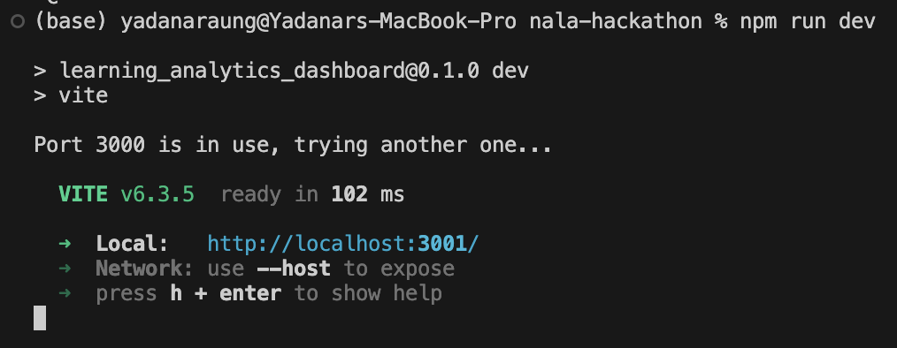
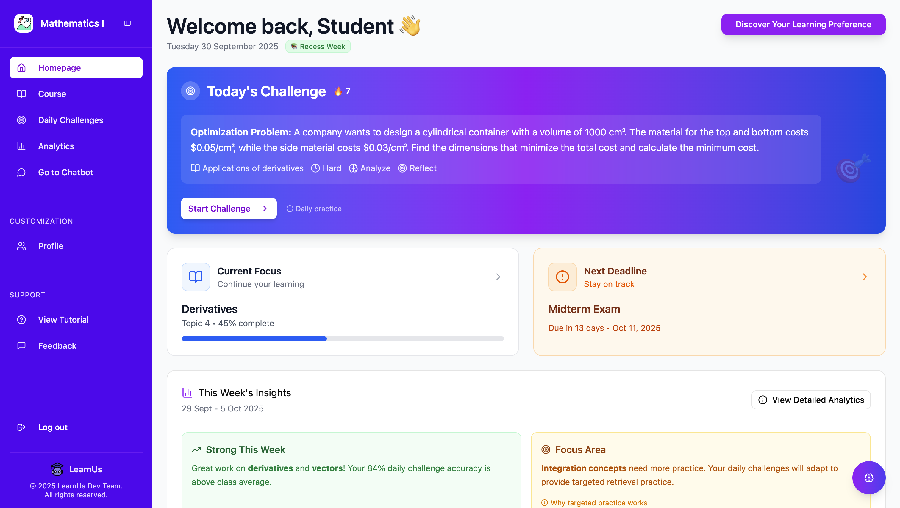

# Learning Analytics Dashboard

This repository contains the code for the Learning Analytics Dashboard, originally designed in [Figma](https://www.figma.com/make/Lxw10CtJdqt4UIYsRb07Cu/Learning-Analytics-Dashboard?fullscreen=1).

## Prerequisites

### Install Ollama

This application uses Ollama with a **hybrid dual-model approach** for optimal AI-powered chat functionality:
- **minicpm-v** for fast, accurate OCR of mathematical work from images
- **llama3.2:3b** for generating well-formatted responses with proper LaTeX notation

1. **Download Ollama:**
   - Visit [https://ollama.ai](https://ollama.ai) and download the installer for your operating system
   - Run the installer and follow the installation instructions

2. **Verify Installation:**
   ```bash
   ollama --version
   ```

3. **Pull both required models:**
   ```bash
   ollama pull minicpm-v
   ollama pull llama3.2:3b
   ```
   
   **Model Details:**
   - **minicpm-v** (~4GB): Optimized for OCR and reading mathematical notation from images. Provides 3-5x faster processing and 85-90% accuracy for math OCR.
   - **llama3.2:3b** (~2GB): Fast text-only model optimized for LaTeX formatting and mathematical reasoning. Much lighter and faster than vision models.
   
   Both downloads may take several minutes depending on your connection.

4. **Start Ollama server:**
   ```bash
   ollama serve
   ```
   The server will run on `http://localhost:11434` by default. **The server can serve both models simultaneously** - you don't need to run multiple instances.

5. **Verify Ollama is running:**
   ```bash
   curl http://localhost:11434/api/tags
   ```
   You should see both `minicpm-v` and `llama3.2:3b` in the list of available models.

## Getting Started

1. **Install dependencies:**
   ```bash
   npm install
   ```
   This will create a `node_modules` folder.

2. **Configure environment variables:**
   ```bash
   cp .env.example .env
   ```
   The default configuration uses the hybrid approach:
   - `VITE_OLLAMA_URL=http://localhost:11434`
   - `VITE_OLLAMA_MODEL=minicpm-v` (for image OCR)
   - `VITE_OLLAMA_TEXT_MODEL=llama3.2:3b` (for text generation)
   
   **How it works:**
   - When you upload an image, minicpm-v reads and transcribes the mathematical content
   - llama3.2:3b then uses that transcription to generate a well-formatted response with proper LaTeX notation
   - For text-only queries (no images), llama3.2:3b is used directly

3. **Run the development server in a terminal:**
   ```bash
   npm run dev
   ```

   If you encounter an error related to `@vitejs/plugin-react-swc`, install it with:
   ```bash
   npm install --save-dev @vitejs/plugin-react-swc
   ```

4. **Run the Flask backend server in another terminal:**
   ```bash
   cd backend
   python backend.py
   ```

5. **Ensure Ollama server is running in a separate terminal:**
   ```bash
   ollama serve
   ```
   
   **Note:** You only need to run `ollama serve` once - it will automatically handle requests for both minicpm-v and llama3.2:3b models.

6. **Expected Output:**
   - All Ollama server, frontend server, and backend server should be running in separate terminals.
   - On successful execution, you should see output similar to the screenshot below:

     
   - The dashboard UI will appear as shown:
   
     
## API Endpoints

The backend provides the following API endpoints:

### Challenges
- `GET /api/challenges` - Get list of challenges with optional filtering
- `GET /api/challenges/<id>` - Get a specific challenge
- `GET /api/challenges/current` - Get today's challenge
- `POST /api/challenges/<id>/attempts` - Submit a challenge attempt
- `GET /api/challenges/stats` - Get user statistics

### User Profile
- `GET /api/user/<user_id>` - Get user profile information (username, email)

### RAG (Retrieval-Augmented Generation)
- `POST /api/ask` - Ask a question using RAG pipeline
- `GET /api/weekly_topics` - Get weekly topic analysis

### Health Check
- `GET /api/health` - Server health check

## Error Handling

The application implements comprehensive error handling:

### Backend Error Handling
- **Global error handlers** for 404, 400, 500, and general exceptions
- **Database wrapper** (`safe_db_operation()`) with automatic rollback on errors
- **Structured error responses** with consistent JSON format:
  ```json
  {
    "error": "Error Type",
    "message": "User-friendly error message",
    "status": 404
  }
  ```

### Frontend Error Handling
- **API Client** (`src/utils/apiClient.ts`) with automatic retry logic and timeout handling
- **Error Messages** (`src/utils/errorMessages.ts`) for user-friendly error display
- **Network error detection** and graceful degradation

### Testing
Run the comprehensive error handling test suite:
```bash
cd backend
python test_all_errors.py
```

The test suite validates:
- Flask error handlers
- Database error handling and rollback
- API endpoint error responses
- Real-life scenarios (SQL injection, malformed JSON, concurrent access, large payloads)
- Frontend error handling utilities

Optional: Test against a running server:
```bash
python test_all_errors.py --live
```

## Database

The application uses SQLite with the following tables:
- `users` - User accounts (id, username, email, password_hash, created_at)
- `challenges` - Daily challenges (id, date, category, difficulty, bloom_level, question, etc.)
- `challenge_attempts` - User attempts at challenges (id, user_id, challenge_id, attempt_number, score, answer, etc.)

### Database Utilities
Located in `backend/database.py`:
- `safe_db_operation()` - Context manager for safe database operations
- `get_user_by_id()` - Fetch user by ID
- `get_challenge_by_id()` - Fetch challenge by ID
- `create_challenge_attempt()` - Create a new attempt record
- `execute_query()` - Execute a generic query safely

### Initialize Database
```bash
cd backend
python init_db.py
```

## Project Structure

```
├── backend/
│   ├── backend.py          # Main Flask server
│   ├── challenges_api.py   # Challenges API endpoints
│   ├── database.py         # Database utilities with error handling
│   ├── schema.sql          # Database schema
│   ├── test_all_errors.py  # Comprehensive error handling tests
│   └── ragcore/            # RAG pipeline components
├── src/
│   ├── components/
│   │   ├── pages/          # Page components
│   │   └── ui/             # Reusable UI components
│   └── utils/
│       ├── apiClient.ts    # API client with retry/timeout logic
│       ├── errorMessages.ts # User-friendly error messages
│       └── challengesApi.ts # Challenges API functions
└── public/
    └── images/             # Static assets
```

## Development

### Running in Development Mode

1. **Frontend (Vite + React):**
   ```bash
   npm run dev
   ```
   Runs on `http://localhost:5173`

2. **Backend (Flask):**
   ```bash
   cd backend
   python backend.py
   ```
   Runs on `http://localhost:5001`

3. **Ollama Server:**
   ```bash
   ollama serve
   ```
   Runs on `http://localhost:11434`

### Testing

```bash
# Run comprehensive error handling tests
cd backend
python test_all_errors.py

# Test against live server (requires backend running)
python test_all_errors.py --live
```