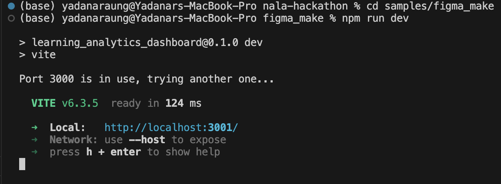

# Learning Analytics Dashboard

This repository contains the code for the Learning Analytics Dashboard, originally designed in [Figma](https://www.figma.com/make/Lxw10CtJdqt4UIYsRb07Cu/Learning-Analytics-Dashboard?fullscreen=1).

## Prerequisites

### Install Ollama

This application uses Ollama with a **hybrid dual-model approach** for optimal AI-powered chat functionality:
- **minicpm-v** for fast, accurate OCR of mathematical work from images
- **llama3.2-vision** for generating well-formatted responses with proper LaTeX notation

1. **Download Ollama:**
   - Visit [https://ollama.ai](https://ollama.ai) and download the installer for your operating system
   - Run the installer and follow the installation instructions

2. **Verify Installation:**
   ```bash
   ollama --version
   ```

3. **Pull both required models:**
   ```bash
   ollama pull minicpm-v
   ollama pull llama3.2-vision
   ```
   
   **Model Details:**
   - **minicpm-v** (~4GB): Optimized for OCR and reading mathematical notation from images. Provides 3-5x faster processing and 85-90% accuracy for math OCR.
   - **llama3.2-vision** (~7GB): Better general reasoning and LaTeX formatting. Used for generating responses with proper mathematical notation.
   
   Both downloads may take several minutes depending on your connection.

4. **Start Ollama server:**
   ```bash
   ollama serve
   ```
   The server will run on `http://localhost:11434` by default. **The server can serve both models simultaneously** - you don't need to run multiple instances.

5. **Verify Ollama is running:**
   ```bash
   curl http://localhost:11434/api/tags
   ```
   You should see both `minicpm-v` and `llama3.2-vision` in the list of available models.

## Getting Started

1. **Install dependencies:**
   ```bash
   npm install
   ```
   This will create a `node_modules` folder.

2. **Configure environment variables:**
   ```bash
   cp .env.example .env
   ```
   The default configuration uses the hybrid approach:
   - `VITE_OLLAMA_URL=http://localhost:11434`
   - `VITE_OLLAMA_MODEL=minicpm-v` (for image OCR)
   - `VITE_OLLAMA_TEXT_MODEL=llama3.2-vision` (for text generation)
   
   **How it works:**
   - When you upload an image, minicpm-v reads and transcribes the mathematical content
   - llama3.2-vision then uses that transcription to generate a well-formatted response with proper LaTeX notation
   - For text-only queries (no images), llama3.2-vision is used directly

3. **Run the development server:**
   ```bash
   npm run dev
   ```

   If you encounter an error related to `@vitejs/plugin-react-swc`, install it with:
   ```bash
   npm install --save-dev @vitejs/plugin-react-swc
   ```

4. **Ensure Ollama is running:**
   Make sure the Ollama server is running in a separate terminal:
   ```bash
   ollama serve
   ```
   
   **Note:** You only need to run `ollama serve` once - it will automatically handle requests for both minicpm-v and llama3.2-vision models.

5. **Expected Output:**
   - On successful execution, you should see output similar to the screenshot below:

     
   - The dashboard UI will appear as shown:
   
     
