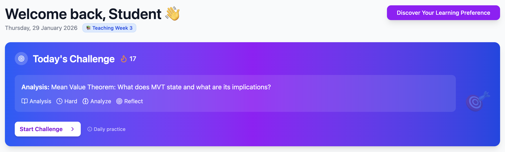
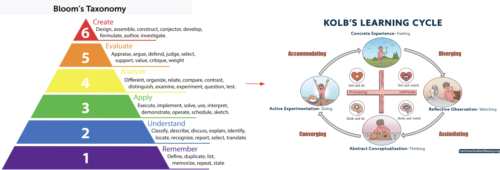
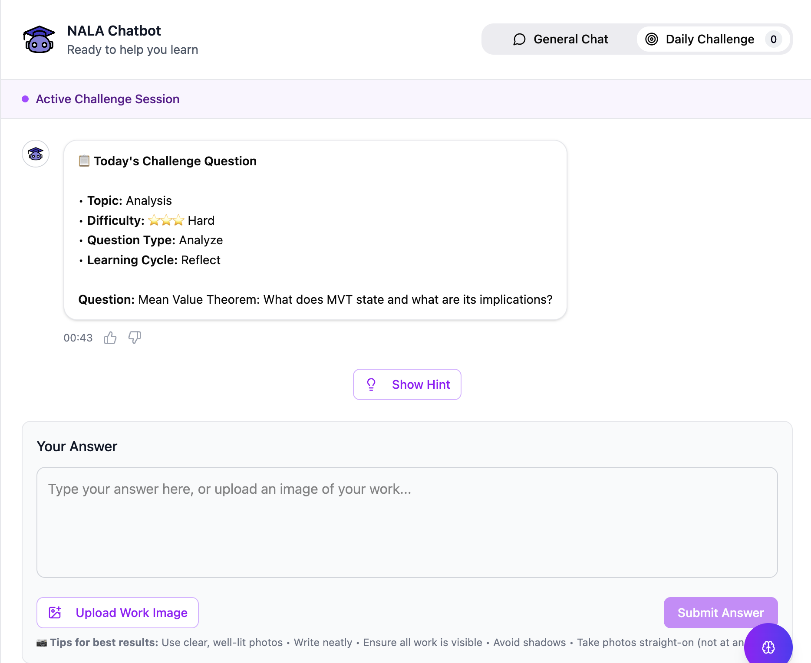
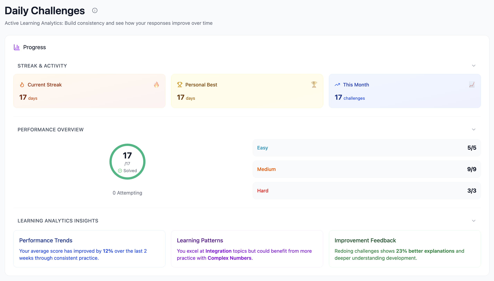
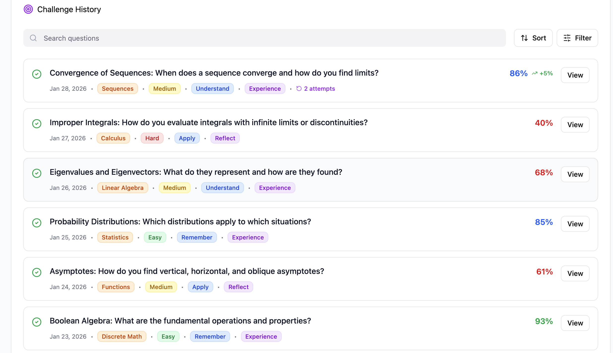
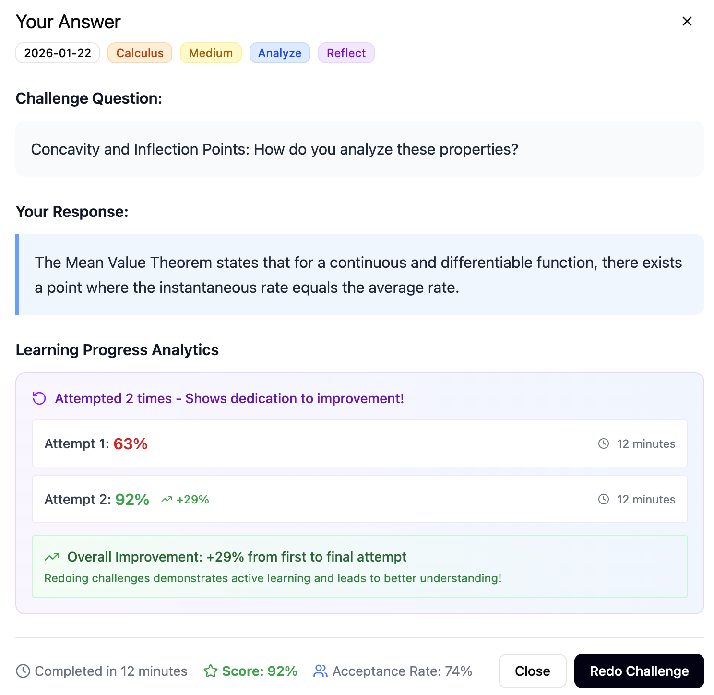

# Daily Challenge Design

## Table of Contents

- [Purpose](#purpose)
- [Progression Logic](#progression-logic)
- [Bloom’s Taxonomy to Kolb’s Learning Stage Mapping](#bloom-to-kolb)
- [User Experience Flow](#user-experience-flow)
- [Streak & Motivation Design](#streak-and-motivation-design)
- [Daily Challenge History & Active Recall](#daily-challenge-history-and-active-recall)
- [Design Rationale & Benefits](#design-rationale-and-benefits)
- [Future Aspirations: Learning Analytics & Feedback](#learning-analytics-and-feedback)

---

## Purpose

The **Daily Challenge** is designed as a *low-friction, high-impact* learning intervention that nudges users into daily active learning. Rather than overwhelming users with long problem sets, the feature focuses on **one curriculum-aligned question** that guides users through the course learning schedule.

Each Daily Challenge varies in **Cognitive level** (Bloom’s Taxonomy), **Learning Cycle** (Kolb's Learning Theory) and **Difficulty level**, allowing users to progressively deepen their understanding of each topic as the course unfolds.

The Daily Challenge serves as a *kickstarter*: even on unmotivated days, completing one question can initiate deeper study, reflection, and engagement with course material.

---

## Progression Logic

In the current implementation, Daily Challenges are **scaffolded along the course learning schedule**.

Each challenge is selected using three structured dimensions:

1. **Course Topic Sequence**: Questions follow the official course progression, ensuring alignment with lectures, tutorials, and upcoming assessments.

2. **Bloom’s Taxonomy Level**: Challenges vary across cognitive levels (Remember → Create), supporting gradual progression from foundational understanding to higher-order thinking.

3. **Kolb’s Experiential Learning Cycle Framing**: Rather than fixed "learning styles", challenges are framed as stages within a **learning cycle**, encouraging users to experience, reflect, conceptualise, and experiment with ideas over time.

This approach ensures consistent, structured practice while laying the foundation for future adaptive personalisation.

---

## Bloom’s Taxonomy to Kolb’s Learning Cycle Mapping 

Each Daily Challenge has a mapping to both Bloom's taxonomy levels and Kolb's learning cycle as follows:

- **Remember/Understand** → **Experience**: "Start with what you know - connect to real situations"
- **Apply/Analyze** → **Reflect**: "Think about why this works or fails - compare different approaches"  
- **Evaluate** → **Conceptualize**: "Build the big picture - understand the principles behind it"
- **Create** → **Experiment**: "Try something new - apply your understanding creatively"

This mapping ensures that Daily Challenges do not just test knowledge, but actively **guide users through a full learning cycle over time**.

---

## User Experience Flow

1. **Challenge Prompt**: Users see a single, clearly framed question with
    - Topic Tag
    - Difficulty Level
    - Bloom’s Level
    - Kolb’s Learning Stage
2. **Answer Submission**: Users submit an answer, explanation, or solution attempt.
3. **Immediate Reflection & Support**: After submission, users can
   - Ask follow-up questions
   - Request explanations
   - Explore alternative solution strategies

---

## Streak & Motivation Design 

The streak feature visualises **consistency over time**, not correctness alone.

- Completing one Daily Challenge per day extends the streak.
- Streaks reward *engagement*, lowering the barrier to participation.
- This design supports habit formation and reduces procrastination.

Rather than gamifying for competition, streaks function as a **self-regulation aid**, reinforcing regular learning behaviours.

---

## Daily Challenge History & Active Recall 

All Daily Challenge attempts are stored as part of a **challenge history**, allowing users to revisit and reflect on past learning activities over time.

### Challenge History

For each Daily Challenge attempt, the system records:

- Challenge question details (e.g. Bloom’s Taxonomy level, Kolb learning stage, etc.)
- User’s submitted response
- Timestamp of the attempt

This history functions as a lightweight learning log, capturing not only *what* users practised, but also *how* they engaged with each concept across time.

### Redoing Challenges to Support Active Recall

Users are able to revisit and redo previously completed Daily Challenges. Redo attempts are intentionally supported to promote **active recall**, a well-established learning strategy that strengthens long-term retention.

By re-attempting the same question after a delay, users are encouraged to:

- Retrieve knowledge from memory rather than re-reading notes
- Compare new responses with prior attempts
- Reflect on how their understanding has evolved

Redoing a challenge does not penalise streaks or progress. Instead, it reinforces learning as an **iterative process**, where revisiting concepts is normal, expected, and beneficial.

---

## Design Rationale & Benefits 

The Daily Challenge provides:

1. **Curriculum Alignment**: Challenges follow the course learning schedule, reinforcing what users are expected to learn each week.
2. **Cognitive Scaffolding**: Variation across Bloom’s levels promotes deeper engagement beyond surface learning.
3. **Metacognitive Awareness**: Explicit links between task type and learning stage help users understand *how* they are learning.
4. **Low Cognitive Load**: One question per day lowers resistance to engagement.
5. **Habit Formation**: Streaks reinforce consistency rather than performance pressure.

Together, these elements transform daily practice into an intentional, reflective learning habit.

---

## Future Aspirations: Learning Analytics & Feedback 

While the current prototype uses schedule-based scaffolding, the design intentionally supports **future extension** toward adaptive challenge selection based on individual learning patterns and analytics.

Daily Challenge history can be fed into learning analytics, allowing users to:

- Observe performance trends over time
- Identify recurring difficulty patterns
- Receive concise improvement feedback (e.g., topic focus, cognitive gaps)
