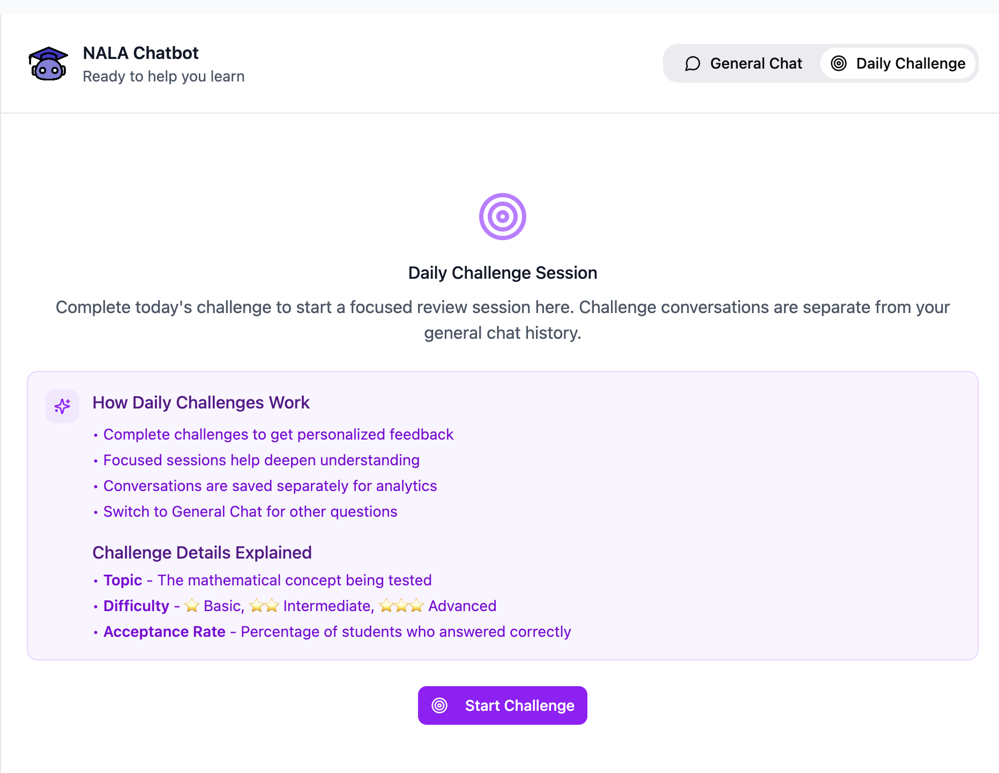

# Daily Challenge Workflow

## Table of Contents

- [Overview](#overview)
- [Entry Points for Starting a Daily Challenge](#entry-points-for-starting-a-daily-challenge)
- [Workflow After Challenge Starts](#workflow-after-challenge-starts)
- [LLM Evaluation Workflow](#llm-evaluation-workflow)
- [Score Extraction and Feedback](#score-extraction-and-feedback)
- [Ending the Challenge Session](#ending-the-challenge-session)
- [Streak Calculation System](#streak-calculation-system)
- [API Endpoints](#api-endpoints)

---

## Overview

This document describes the **end-to-end Daily Challenge workflow**, covering:

- **Entry points** for starting daily challenge
- The **evaluation process** using ground truth answers and LLM scoring
- **Database submission**, statistics updates, and streak calculation
- Relevant **API endpoints** and implementation details

---

## Entry Points for Starting a Daily Challenge

The Daily Challenge can be initiated from **four different entry points**. Regardless of the entry point used, the downstream workflow remains consistent.

### Entry Point 1: Homepage – "Start Challenge" Button


- **File Location**: `Homepage.tsx`
- **Flow**:
  1. User clicks **"Start Challenge"** button on the homepage
  2. Today’s challenge data is fetched via API
  3. Challenge data is passed to `onStartChallenge` callback
  4. `App.tsx` sets challenge data
  5. User is redirected to `GeneralChatbot` in challenge mode
  6. Challenge question is displayed
- **Implementation**:
  ```typescript
  // App.tsx
  onStartChallenge={(challengeData) => {
    setCurrentChallengeData(challengeData || null);
    setStartingChallenge(true);
    setShowGeneralChatbot(true);
    setActiveSection('');
  }}
  ```

---

### Entry Point 2: Daily Challenges Page – "Start Challenge" Button


- **File Location**: `DailyChallengesPage.tsx` (Challenge row action button)
- **Flow**:
  1. User navigates to Daily Challenges page
  2. User clicks **"Start Challenge"** button on a specific challenge
  3. Full challenge data are fetched via API
  4. Challenge data is passed to `onStartChallenge` callback
  5. `App.tsx` sets challenge data
  6. User is redirected to `GeneralChatbot` in challenge mode
  7. Challenge question is displayed
- **Implementation**:
  ```typescript
  // DailyChallengesPage.tsx - Start Challenge button
  <Button 
    onClick={async () => {
      try {
        const fullChallenge = await fetchChallenge(challenge.id);
        onStartChallenge?.(fullChallenge);
      } catch (err) {
        console.error('Error fetching challenge:', err);
        onStartChallenge?.(challenge);
      }
    }}
  >
    Start Challenge
  </Button>
  ```

---

### Entry Point 3: Daily Challenges Page – "Redo Challenge" Button


- **File Location**: `DailyChallengesPage.tsx` (Challenge details modal)
- **Flow**:
  1. User views a completed challenge's details
  2. User clicks **"Redo Challenge"** button in the modal
  3. Full challenge data is fetched via API
  4. Modal closes and user is redirected to `GeneralChatbot` in challenge mode
  5. Challenge question is displayed
- **Implementation**:
  ```typescript
  // DailyChallengesPage.tsx - Redo Challenge button
  <Button onClick={async () => {
    setShowAnswerModal(false);
    if (onStartChallenge && selectedChallenge) {
      try {
        // Fetch fresh challenge data including ground truth
        const fullChallenge = await fetchChallenge(selectedChallenge.id);
        onStartChallenge(fullChallenge);
      } catch (err) {
        console.error('Error fetching challenge for redo:', err);
        // Fallback to selected challenge data
        onStartChallenge(selectedChallenge);
      }
    }
  }}>
    Redo Challenge
  </Button>
  ```

---

### Entry Point 4: Direct Chatbot Access with "Start Challenge" Button



- **File Location**: `GeneralChatbot.tsx` (Daily Challenge tab)
- **Flow**:
  1. User navigates directly to chatbot page
  2. User switches to **"Daily Challenge"** tab
  3. User clicks **"Start Challenge"** button
  4. `GeneralChatbot` fetches today's challenge data via API
  5. Challenge question is displayed
- **Implementation**:
  ```typescript
  // GeneralChatbot.tsx - handleStartChallenge
  const handleStartChallenge = useCallback(async (challenge?: any) => {
    let challengeToUse = challenge || challengeData;
    const now = new Date();
    
    // If no challenge data provided, fetch today's challenge from API
    if (!challengeToUse || !challengeToUse.question) {
      try {
        console.log('No challenge data provided, fetching today\'s challenge...');
        challengeToUse = await fetchCurrentChallenge();
        console.log('Fetched today\'s challenge:', challengeToUse);
      } catch (err) {
        console.error('Error fetching today\'s challenge:', err);
      }
    }
    
    // Display challenge question...
  }, [challengeData]);
  ```

---

## Workflow After Challenge Starts

Regardless of entry point, the following steps always occur:

1. **Challenge Display**: Challenge question shown with metadata (topic, difficulty, and Bloom level)
2. **User Answers**: User submits an answer (text or image) by clicking on "Submit Answer" button
3. **LLM Evaluation**: Response evaluated against ground truth, scored 0-100%
4. **Feedback**: Detailed feedback displayed with score
5. **Follow-up**: User can ask follow-up questions
6. **Session End**: User clicks "End Daily Challenge Session"
7. **Database Storage**: Attempt stored in database with score, answer, time spent
8. **Statistics Update**: User statistics are refreshed on Daily Challenges page

---

## LLM Evaluation Workflow

When the user submits their answer, the following happens in `GeneralChatbot.tsx`:

### Prompt Construction

The LLM receives a prompt containing:

- **Challenge Question**: The original question from the database
- **Ground Truth Answer**: The expert reference answer from the database
- **Student's Answer**: The user's written response or image of their work
- **Evaluation Instructions**: Detailed rubric for scoring

### Scoring Rubric (100%)

- **Correctness (50%)**: Are the main concepts and final answer correct?
- **Completeness (25%)**: Are all key steps and explanations included?
- **Clarity & Notation (15%)**: Is the work clear, organized, and properly notated?
- **Understanding (10%)**: Does the answer demonstrate deep conceptual understanding?

### LLM Response Format

The LLM response will start with:
```
**SCORE: X/100**
```

Followed by detailed feedback comparing the student’s answer to the ground truth.

---

## Score Extraction and Feedback

- Frontend extracts the score from the LLM response using regex pattern matching
- Score is stored in component state for later submission
- Full feedback is displayed to the user
- Follow-up questions are supported

---

## Ending the Challenge Session

When the user clicks **"End Daily Challenge Session"** button:

### Time Spent Calculation

```
Time Spent = Current Time - Challenge Start Time
Format: "X minutes" or "Less than 1 minute"
```

### Attempt Submission to Database

POST `/api/challenges/{challenge_id}/attempts`

```json
{
  "user_id": 1,
  "answer": "User's answer",
  "score": 85.5,
  "time_spent": "15 minutes",
  "status": "completed"
}
```

### Automatic Statistics Updates

The database automatically updates:
- User's total solved challenges
- Difficulty statistics
- Current streak
- Monthly attempts
- Challenge-specific attempt history

---

## Streak Calculation System

### Algorithm

1. **Filter First Attempts Only**: Only `attempt_number = 1` counts toward streak
2. **Same-Day Completion**: Only attempts completed on the challenge date count
3. **Consecutive Days**: Streak breaks if a day is skipped
4. **Current Streak**: Must include today or yesterday to be active

### Implementation

- **SQL Query**:
  ```sql
  SELECT c.date as challenge_date, MIN(DATE(ca.created_at)) as completed_date
  FROM challenge_attempts ca
  JOIN challenges c ON ca.challenge_id = c.id
  WHERE ca.user_id = ? 
    AND ca.attempt_number = 1
    AND ca.status = 'completed'
  GROUP BY c.id, c.date
  HAVING DATE(ca.created_at) = c.date
  ORDER BY c.date DESC
  ```

- **Python**:
  ```python
  # Current streak calculation
  if most_recent_date == today or most_recent_date == today - timedelta(days=1):
      current_streak = 1
      expected_date = most_recent_date - timedelta(days=1)
      
      for challenge in challenges[1:]:
          if challenge_date == expected_date:
              current_streak += 1
              expected_date -= timedelta(days=1)
          else:
              break  # Streak broken
  ```

---

## API Endpoints

For more information, refer to [API_ENDPOINTS.md](API_ENDPOINTS.md).

- `GET /api/challenges`: Get list of challenges with optional filtering
- `GET /api/challenges/{challenge_id}`: Get a specific challenge data
- `GET /api/challenges/current`: Get today's challenge data
- `POST /api/challenges/<challenge_id>/attempts`: Submit a challenge attempt
- `GET /api/challenges/stats`: Get user statistics
