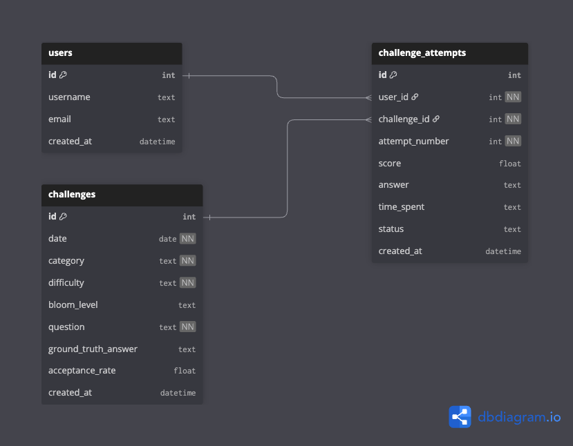

# Database Models

## Table of Contents

- [Entity Relationship Diagram](#entity-relationship-diagram)
- [Users](#users)
- [Challenges](#challenges)
- [Challenge Attempts](#challenge_attempts)

## Entity Relationship Diagram 

## Users 

- Table Name: `users`

- Description: Stores user information for students attempting daily challenges.

- Columns:
  - `id` (Integer, primary key, auto-increment): Unique identifier for each user.
  - `username` (String, unique): Username of the user.
  - `email` (String, unique): Email address of the user.
  - `created_at` (String, default now()): Timestamp indicating when the user account was created.

- Relationships:
  - A user has a one-to-many relationship with the `challenge_attempts` table via the `user_id` foreign key.

## Challenges 

- Table Name: `challenges`

- Description: Stores daily challenge questions that users can attempt. Each challenge acts as a reusable template for user attempts.

- Columns:
  - `id` (Integer, primary key, auto-increment): Unique identifier for each challenge.
  - `date` (String): Date on which the challenge is published (YYYY-MM-DD).
  - `category` (String): Topic category of the challenge (e.g., Algebra, Calculus).
  - `difficulty` (String): Difficulty level of the challenge (Easy, Medium, Hard).
  - `bloom_level` (String, nullable): Bloom’s taxonomy level associated with the challenge.
  - `question` (String): The challenge question presented to users.
  - `ground_truth_answer` (String, nullable): Reference answer used for evaluation.
  - `acceptance_rate` (Real, nullable): Percentage of correct attempts across all users.
  - `created_at` (String, default now()): Timestamp indicating when the challenge was created.

- Relationships:
  - A challenge has a one-to-many relationship with the `challenge_attempts` table via the `challenge_id` foreign key.

## Challenge Attempts 

- Table Name: `challenge_attempts`

- Description: Stores individual user attempts for each challenge, allowing multiple attempts per user.

- Columns:
  - `id` (Integer, primary key, auto-increment): Unique identifier for each challenge attempt.
  - `user_id` (Integer, foreign key): ID of the user who made the attempt.
  - `challenge_id` (Integer, foreign key): ID of the challenge being attempted.
  - `attempt_number` (Integer): Attempt sequence number for a specific user and challenge (e.g. 1, 2, 3, etc.).
  - `score` (Real, nullable): Score achieved for the attempt between 0 to 100.
  - `answer` (String, nullable): Answer submitted by the user.
  - `time_spent` (String, nullable): Time spent on the attempt (e.g., "15 minutes").
  - `status` (String, default "pending"): Status of the attempt (e.g., "pending", "completed").
  - `created_at` (String): Timestamp indicating when the attempt was made.

- Constraints:
  - A unique constraint is enforced on (`user_id`, `challenge_id`, `attempt_number`) to ensure that each attempt number is unique per user per challenge.

- Relationships:
  - A challenge attempt has a many-to-one relationship with the `users` table via the `user_id` foreign key.
  - A challenge attempt has a many-to-one relationship with the `challenges` table via the `challenge_id` foreign key.
