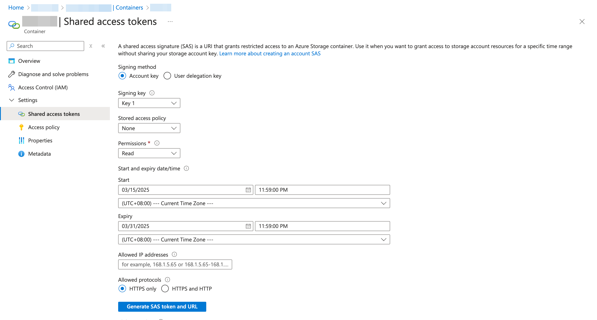
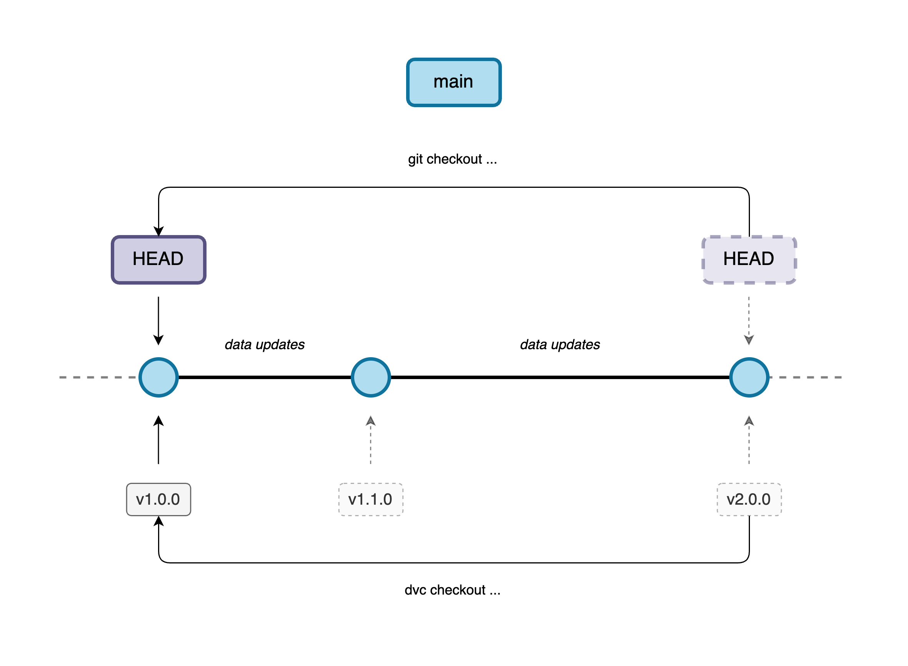

# Data Management

## Table of Contents

- [Overview](#overview)
- [Prerequisites](#prerequisites)
- [Retrieving Data](#retrieving-data)
- [Azure Integration](#azure-integration)
  - [Managing SAS Token](#managing-sas-token)
- [Data Versioning](#data-versioning)
  - [Data Updates](#data-updates)
  - [Revert Data Version](#revert-data-version)

## Overview <a id="overview"></a>

To manage datasets effectively, maintain reproducibility, and track changes over time, we utilize **Data Version Control ([DVC](https://dvc.org/))**. DVC extends traditional version control (like Git) by efficiently handling large data files and machine learning models. It allows tracking dataset versions, facilitating collaboration, and enabling reproducibility of experiments through pipeline management.

Key advantages of using DVC include:

- **Data versioning**: Keep track of multiple dataset versions.
- **Reproducible pipelines**: Define and share data-processing steps clearly.
- **Efficient storage**: Handles large data without bloating Git repositories.
- **Collaboration**: Streamlines data sharing among team members.

Refer to the sections below for detailed guidelines on setting up, configuring, and working with DVC.

## Prerequisites <a id="prerequisites"></a>

Ensure you have met the [prerequisites](../README.md#prerequisites) in the [Getting Started](../README.md#getting-started) section. Run `dvc --version` to confirm you have DVC installed.

## Retrieving Data <a id="retrieving-data"></a>

> [!IMPORTANT]
> Before development work, ensure the data is available in your environment and is up-to-date. Please refer to the following steps to retrieve the latest data.

1. **Set Environment Variables**

   In the root of this project, you will find a [`.env.sample`](../.env.sample). It should look like this:

   ```yaml
   AZURE_STORAGE_ACCOUNT=
   AZURE_KEY_VAULT=
   AZURE_URL=
   SECRET_NAME=
   ```

   Create an `.env` file and copy and paste the contents from above into it.

> [!NOTE]
> Consult a [Data Controller](#data-controller) for the required credentials. Once they are set, the SAS token can be retrieved via the [`fetch_sas_token.py`](../scripts/fetch_sas_token.py) file which is called in the`setup_dvc.*` scripts.

2. **Set up DVC**

   Once the environment variables have been set up, you can run the following command to retrieve the SAS token and set up the DVC configurations:

   For Linux or macOS users, run:

   ```bash
   ./scripts/setup_dvc.sh
   ```

   For Windows users, run:

   ```powershell
   ./scripts/setup_dvc.ps1
   ```

   After execution, the script updates all remote data repositories in the [config](../.dvc/config) file and sets credentials in a local configuration file — not version-controlled with Git.

3. **Retrieve Data**

   Lastly, run the following command to get the latest version of data respectively:

   ```bash
   ./scripts/get_data.sh
   ```

   For Windows, run:

   ```powershell
   ./scripts/get_data.ps1
   ```

   After execution, you should see all the data in the [`data`](../data/) folder. It may take a while for all the data to be downloaded if this is your first time pulling them in. For more information, refer to this [user guide](https://dvc.org/doc/user-guide/data-management/remote-storage/azure-blob-storage) on how to integrate DVC with Microsoft Azure Blob Storage.

> [!NOTE]
> If you encounter any issues, please consult a [Data Controller](#data-controller). Usually, an error occurs when the SAS token has expired. If so, please consult the [Managing SAS Token](#managing-sas-token) section to generate a new SAS token.

## Azure Integration <a id="azure-integration"></a>

We are using Azure Blob Storage as our remote storage for DVC.

1. **Data Controller** (Maintains Remote Storage + Google Drive) <a id="data-controller"></a>

   - Controls the data version in Azure.
   - Versions the `.dvc` files with Git (i.e. `git push`) so that [Data Users](#data-user) can retrieve the correct data version from the remote storage.
   - Updates the data files in Google Drive, for [Data Viewers](#data-viewer) to view the data.
   - Manages the Azure resources.
   - Generates, stores and updates the SAS token as a Secret in Azure Key Vault.

> [!NOTE]
> Refer to the [Managing SAS Token](#managing-sas-token) section for more information on how to manage the SAS token required for DVC to interact with Azure Blob Storage.

2. **Data User** (Interacts with Remote Storage) <a id="data-user"></a>

   - Pulls in versioned-controlled data:
     - Run `git pull` to retrieve latest `.dvc` files.
     - Run the `get_data.*` scripts to retrieve the latest data for development.

> [!NOTE]
> Refer to [Retrieving Data](#retrieving-data) for more details on the steps to retrieve the latest data

3. **Data Viewer** (Interacts with Google Drive) <a id="data-viewer"></a>

   - Views raw data found in the Google Drive.

### Managing SAS Token <a id="managing-sas-token"></a>

We use SAS Token as our authentication method to set up the remote configuration to the Azure Blob Storage. The [Data Controller](#data-controller) will perform the steps to generate the SAS token. For more information, refer to this [user guide](https://dvc.org/doc/user-guide/data-management/remote-storage/azure-blob-storage) on how to integrate DVC with Microsoft Azure Blob Storage.



_Steps to Generate SAS Token_

**Steps (Generate SAS token)**:

1. Create an **Azure Storage Account**
2. Click on **$+$ Container** > Enter a name for your container > **Create**
3. Click on your new container > Under **Settings** > Click on **Shared access token**
4. Under **Signing method** > Select **Account key**
5. Under **Permissions** > Check **Read**, **Write**, **Delete** and **List**
6. Under **Start** and **Expiry** > Set the date and time
7. Under **Allowed protocols** > Select **HTTPS only**
8. Click on **Generate SAS token and URL** > Copy the SAS token

> [!CAUTION]
> Once you exit the Azure page, you can no longer find the SAS token as Azure does not store it. It is important for [**Data Controllers**](#data-controller) to note down the following details of the latest SAS token:
>
> 1. Creation Date
> 2. Expiration Date
> 3. SAS Token
> 4. (Optional) Blob SAS URL

## Data Versioning <a id="data-versioning"></a>



_Versioning workflow in DVC and Git: This diagram illustrates how data updates are tracked using DVC while code changes are managed through Git. The HEAD in Git moves with `git checkout`, while `dvc checkout` retrieves the corresponding data version. Tagged versions (`v1.0.0`, `v1.1.0`, `v2.0.0`) represent different stages of the dataset, ensuring reproducibility across data updates._

### Data Updates <a id="data-updates"></a>

When you have made an update or change to the data, you can run the following commands to version the newly updated data:

```bash
dvc add <PATH_TO_RAW_DATA>

# or you can simply run `dvc push --remote <REMOTE_NAME>` if you've only staged a single raw data
dvc push <PATH_TO_RAW_DATA> --remote <REMOTE_NAME>
```

You should see an updated version of a `.dvc` file of your updated data. It is best practice to version control this `.dvc` file with Git whenever a change has been made to any data. This `.dvc` file tracks the versioning of your data and is crucial when you want to revert back to a previous version of your data. You may run the following commands to track changes in Git:

```bash
git add <PATH_TO_RAW_DATA>.dvc
git commit -m "chore: raw data updated; version control new .dvc file"
git push
```

### Revert Data Version <a id="revert-data-version"></a>

If and when you wish to revert back the data to a previous version, you can run the following commands to retrieve it back:

```bash
git log # view commit log to find specific commit to revert back to
git checkout <COMMIT_HASH>
dvc checkout # reverts local raw data version
```

You should see a reverted version of a `.dvc` file of your reverted data. It is best practice to version control this `.dvc` file with Git whenever a change has been made to any data. This `.dvc` file tracks the versioning of your data and is crucial when you want to revert back to a previous version of your data. You may run the following commands to track changes in Git:

```bash
git checkout main
dvc add <PATH_TO_RAW_DATA>
dvc push <PATH_TO_RAW_DATA> --remote <REMOTE_NAME>
git add .
git commit -m "chore: revert data version; version control previous .dvc file"
git push
```
